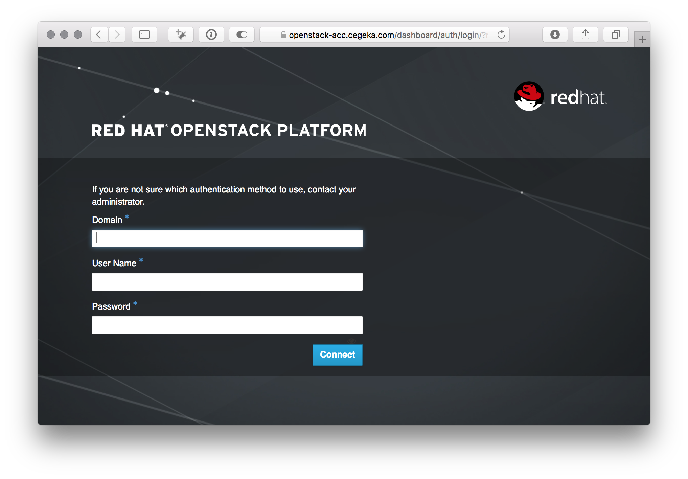

# Greenfield OpenStack Workshop

## Context

### OpenStack and Greenfield

> [OpenStack is a cloud operating system](https://www.openstack.org/software/) that controls large pools of compute, storage, and networking resources throughout a datacenter, all managed through a dashboard that gives administrators control while empowering their users to provision resources through a web interface.

### Infrastructure As Code

## Technical Setup

You will be interacting with the Greenfield OpenStack in two ways: the web dashboard and the commandline interface.

- The _Greenfield Web Dashboard_ is a convenient way to view and manage your OpenStack setup.
- The _Greenfield commandline interface_ is better suited for an interface-as-code way of interacting. For instance by issuing a command to load pre-defined configuration templates from a file, or to invoke specific commands to bring up an instance, etc.

# Hands-on Time

After this introduction, it's up to you to get your hands dirty. We propose you start with the most simple task of creating a single Linux server that you can log into with SSH.

## A Single Server with SSH Access

Setting up a single linux server that you can access through SSH requires a number of things:
1. Network
2. Security Group (firewall rules)
3. Image (linux distro)
4. Instance (virtual machine)

1. Browse to the [Greenfield Web Dashboard](https://openstack-acc.cegeka.com) (open in a new tab). You should arrive on a page that looks like in the following image.
    
Enter the credentials that have been handed to you at the start of the session (your username and password are under the heading __1.2 Openstack environment__). 
> - Domain: "cegekanv"
> - Username: your username
> - Password: your password
2. 

## Deploying a Loadbalanced Wordpress application
