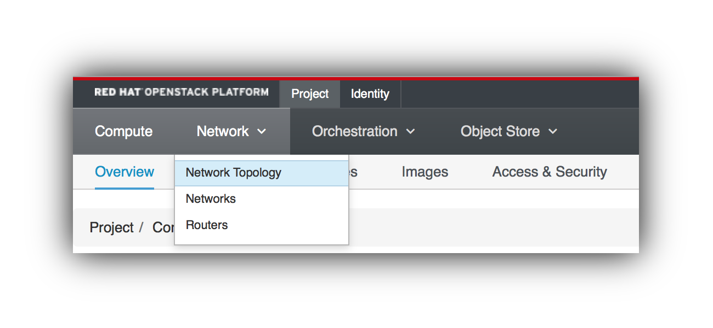
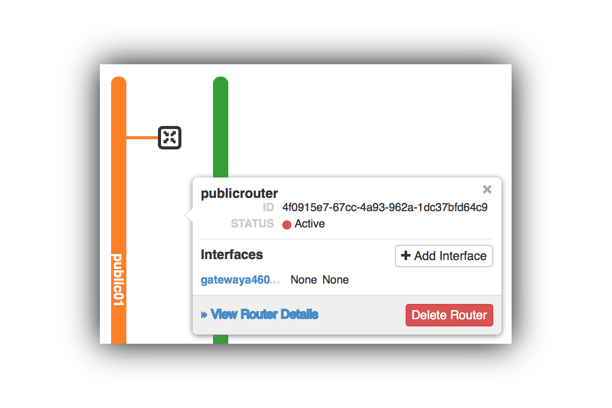
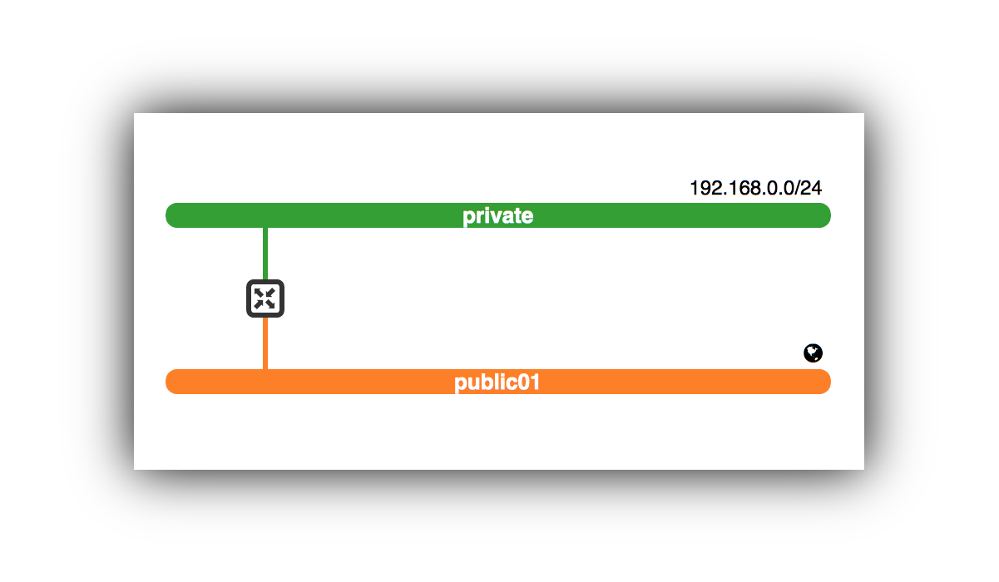
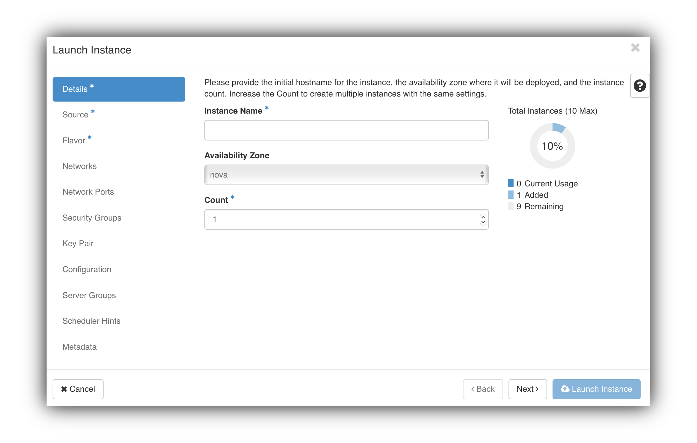

# Greenfield OpenStack Workshop

## Context

### OpenStack and Greenfield

> [OpenStack is a cloud operating system](https://www.openstack.org/software/) that controls large pools of compute, storage, and networking resources throughout a datacenter, all managed through a dashboard that gives administrators control while empowering their users to provision resources through a web interface.


### Infrastructure As Code

## Technical Setup

You will be interacting with the Greenfield OpenStack in two ways: the web dashboard and the commandline interface.

- The _Greenfield Web Dashboard_ is a convenient way to view and manage your OpenStack setup.
- The _Greenfield commandline interface_ is better suited for an interface-as-code way of interacting. For instance by issuing a command to load pre-defined configuration templates from a file, or to invoke specific commands to bring up an instance, etc.

_After this introduction, it's up to you to get your hands dirty. We propose you start with the most simple task of creating a single Linux server that you can log into with SSH._

## A Single Server with SSH Access

In OpenStack, setting up a single linux server that you can access through SSH requires a number of things:
1. Network 
2. Security Group (firewall rules that allow incoming SSH traffic)
3. Instance (virtual machine)
4. Floating IP (a public IP to access your instance)

### 0. Access the Greenfield Dashboard
Browse to the [Greenfield Web Dashboard](https://openstack-acc.cegeka.com) (open in a new tab). You should arrive on a page that looks like the following image. 
Enter the credentials that have been handed to you at the start of the session (your username and password are under the heading __1.2 Openstack environment__).

> Domain: "cegekanv"
> Username: {provided}
> Password: {provided}

You will be greeted with the Dashboard screen showing the amount of free and used resources. 
These resources are:
- Instances: ...
- TODO

### 1. Set up a network
One of the first things to do in a vanilla Greenfield environment (called project), is setting up a private network and a router that allows traffic to flow from and to the public network (the internet). To create a network navigate to _Network_ in the menu bar at the top, and click _Network Topology_. 



#### Create a network and subnet
On the right of the Network Topology screen are three buttons, click ```Create Network```.

1. Give your network the name ```private``` and go the next step. 
2. For the subnet, under Network Address, enter ```192.168.0.0/24```. Go to the final step. 
3. Finally, we need a set of DNS servers. For demonstration purposes we will use Google's DNS servers (```8.8.8.8``` and ```8.8.4.4```). Add these in the DNS Name Servers edit box (each on its own line) and click Create. Don't use these DNS records on actual production systems! 

Your network is created and visualised in the topology (properly rotated here for your viewing pleasure). 


#### Create a router
Next, we need to add a router to allow traffic to flow between the public and private networks. On the _Network Topology_ tab, on the right side, click ```Add Router```.

1. Give your router a name (e.g. publicrouter) and select an External Network from the dropdown box (scroll down if you don't see the dropdown box). ___If there is more than one option, ask one of the tutors which one you should select___. Click the ```Create Router``` buttton. 
2. Back on the _Network Topology_ screen, click on the router icon in the illustration and click on the ```add interface``` button in the popup that appears. 
3. In the Add Interface wizard, select your private subnet from the dropdown box, and click the ```Submit``` button.

Your private network is now connected to the public network through the router. You can verify this connection in the topology visualization. 



_This concludes the network setup. All virtual machines (instances in openstack terminology) added to this private network will have access to the public network._

### 2. Define a Security Group
A security group defines the rules for networking access between instances. The default security group defines that all outgoing traffic from instances is allowed, but all incoming traffic is blocked.

To be able SSH into the instance we will later create, we need to allow incoming SSH traffic.

Setting up a security group is done through the ```Access & Security``` tab under the ```Compute``` menu.


1. In the Access & Security screen, click ```Create Security Group```. Create a security group by the name ```ssh-access-incoming```.
2. In the Security Group management screen you will see that two rules have been created by default. We will add a rule that allows incoming SSH traffic. Click ```Add Rule```. 
3. In the Add Rule screen, select the ```SSH``` rule from the dropdown box and leave Remote set to ```CIDR```. This will allow incoming ssh traffic from any IP (this is probably not a good idea on a production system). Create the rule. 

_This completes the creation of a Security Group that allows incoming SSH traffic. We will later attach this Security Group to our SSH server instance. this will allow incoming SSH traffic to flow to the instance._

### 3. Launching an Instance

At this time, the project doesn't have any instances running. You can verify this by consulting the Instances tab, under the Compute menu.

Now, head back to the Network Topology tab, under the Network menu. Clicking the ```Launch Instance``` button will start the wizard to configure a new instance.



1. On the ```Details``` screen, provide a name for your instance (eg. "ssh-server"). You will be limited in the amount of instances you can create by the resources that have been reserved for your project. Move on the the ```Source``` screen.
2. In the source screen, pick ```Image``` fom the ```Select Boot Source``` screen and add the ```centos7``` image by tapping the plus-sign behind its name.
3. In the ```Flavor``` screen, add the ````m1.small```` flavor (tap on the plus).
4. Finally, skip to ```Security Groups``` and add the ```ssh-access-incoming```security group that we created earlier.
5. Launch the Instance.

_The Topology visualization will show the Instance we just created from a centos7 image. The instance will be allowed incoming SSH traffic._


### 5. Assign a public (floating) IP to an Instance

To be able to access the ssh-server instance from outside the greenfield project sandbox, we will need to attach a floating IP to the ssh-server instance.

1. Go to the Instances tab, under the Compute menu. Find the ssh-server instance in the list. In the ssh-server row, click the down arrow on the button and select ```Associate Floating IP```. 
2. In the ```Manage Floating IP Associations``` screen, select a floating IP from the dropdown box. If no floating IPs have been assigned to you, hit the plus button. 
3. [optional] Allocating a floating IP is only possible when there are public IPs left for you to reserve. From the ```Pool``` dropdown, select the same public network you selected for the router during the network setup. Allocate the IP. 
4. In the ```Port to be associated``` dropdown, select the ssh-server instance.
5. Click Associate.

_The ssh-sever instance has now been allocated a floating IP. It is now accessible from outside of the OpenStack sandbox on the floating IP you have selected. In a true cloud application, floating IPs are used sparringly. Only to expose the instances that need to be accessible from the outside._

### 5. Connecting to the ssh-server using SSH

We are now ready to access our ssh-server through SSH. Because authentication in Greenfield is key-based (instead of password-based) and to keep the setup at the start of the workshop simple, we have prepared a steppingstone server that has the private key installed.

To access the steppingstone machine, you need a terminal application like putty or ssh. Use the credentials that have been handed to you at the start of the session (your username and password are under the heading __1.1 Linux stepping-stone machine__).

> hostname: factoryfestival-steppingstone.cegeka.com
> protocol: SSH
> username: {provided}
> password: {provided}

Once logged into the steppingstone server, use ```ssh``` to log into your instance. You will need the floating IP that you have associated to your instance before. Just ssh to that IP, with username ```centos``` (hardcoded into the centos7 image).

> ssh -l centos {floatingip}


Congratulations, this is the end of the walkthrough. If you have some time left you can proceed to the next section.

## Deploying a Autoscaling Wordpress application

### Prepare your work environment

#### Context

This section uses patterns to build an autoscaling 3-tier wordpress application.
Here we use descriptive language to define the infrastructure in code, rather than manually implementing it step-by-step.

#### Let's do it!

Use the hand-out, you can find username and password under the heading __1.1 Linux stepping-stone machine__).

####1. Log in to the stepping stone machine using ```ssh```.

####2. Set the environment.

> `source ospdemo<yournumber>rc`

> `cd openstack-heat-templates`

####3. Create the stack

In the GUI, navigate to Orchestration - Stacks.

On the commandline, issue:

> `openstack stack create --template WebAppAutoScaling.yaml --parameter ssh_key_name=demo --parameter image_id=centos7 --parameter dns_nameserver="8.8.8.8,8.8.8.4" --parameter public_network_id=public01 mystackname`

You should get following response: 


Congratulations your stack is being built. You can check its progress by navigating in the GUI to the stack and choosing Topology or by issuing the command:

> `openstack stack list`

You can also take a look at the compute instances and network configurations being created in the GUI or via the command line.

> `openstack server list`

> `openstack router list`

If you wish to explore the options of the command line issue the following command to view all the options:

> `openstack --help`

By now your stack should be deployed and ready to use. 

__There should be at least 2 minutes between creating the stack and this point in time

####4. Configure Wordpress.

In the GUI navigate to __Orchestration - Stacks. 

Click on the link of your stack.

Navigate to __Overview

Look for the IP address next to __web_lbaas_ip

Use your browser to surf to this IP address

Enter name, user, password... to configure Wordpress.

