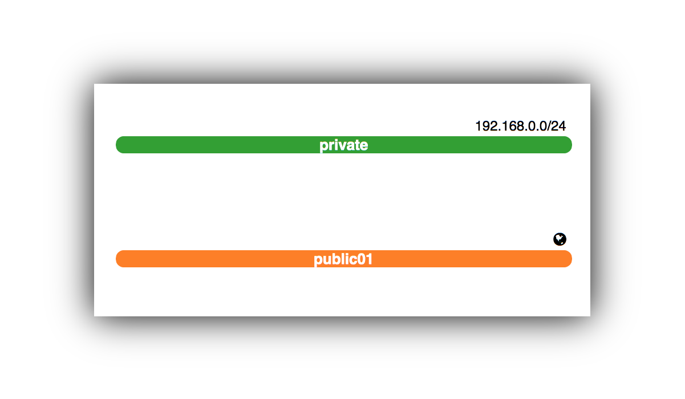

# Greenfield OpenStack Workshop

## Context

### OpenStack and Greenfield

> [OpenStack is a cloud operating system](https://www.openstack.org/software/) that controls large pools of compute, storage, and networking resources throughout a datacenter, all managed through a dashboard that gives administrators control while empowering their users to provision resources through a web interface.


### Infrastructure As Code

## Technical Setup

You will be interacting with the Greenfield OpenStack in two ways: the web dashboard and the commandline interface.

- The _Greenfield Web Dashboard_ is a convenient way to view and manage your OpenStack setup.
- The _Greenfield commandline interface_ is better suited for an interface-as-code way of interacting. For instance by issuing a command to load pre-defined configuration templates from a file, or to invoke specific commands to bring up an instance, etc.

# Hands-on Time

After this introduction, it's up to you to get your hands dirty. We propose you start with the most simple task of creating a single Linux server that you can log into with SSH.

## A Single Server with SSH Access

Setting up a single linux server that you can access through SSH requires a number of things:
1. Network 
2. Security Group (firewall rules that allow SSH traffic)
3. Image (a linux distro)
4. Instance (virtual machine)
5. Floating IP (to access your instance)

### Walkthrough

#### 1. Access the Greenfield Dashboard
Browse to the [Greenfield Web Dashboard](https://openstack-acc.cegeka.com) (open in a new tab). You should arrive on a page that looks like the following image.
    
Enter the credentials that have been handed to you at the start of the session (your username and password are under the heading __1.2 Openstack environment__).

> - Domain: "cegekanv"
> - Username: provided username
> - Password: provided password

You will be greeted with the Dashboard screen showing the amount of free and used resources.


#### 2. Setting up a network
One of the first things to do in a vanilla Greenfield environment, is setting up a private network and a router that allows traffic to flow from and to the public network (the internet). To create a network navigate:
    
- Navigate to _Network_ in the menu bar at the top, and click _Network Topology_. 
- On the right, there are three buttons, click the middle one that is named ```+ Create Network```. 
    1. Give your network the name ```private``` and click the Next button. 
    2. For the subnet, enter under Network Address ```192.168.0.0/24``` and click the Next button. 
    3. Finally, add Google's DNS servers (8.8.8.8 and 8.8.4.4) in the ```DNS Name Servers``` edit box (each on its own line) and click the Create button. 
- Your network is created and visualised in the topology (properly rotated here for your viewing pleasure). 

#### 3. 

## Deploying a Loadbalanced Wordpress application
