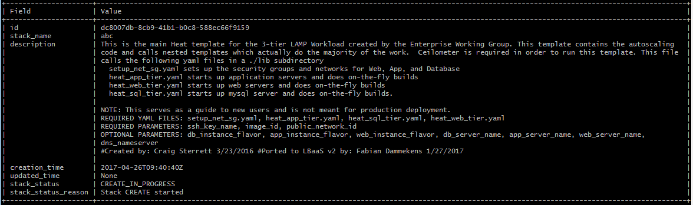

# Deploying an autoscaling Wordpress application

This section uses heat orchestration templates to build an autoscaling three-tier wordpress application.
Here we use descriptive language to define the infrastructure in code, rather than manually implementing it step-by-step.

Use the hand-out, you can find username and password under the heading __1.1 Linux stepping-stone machine__).

## 0. Destruction

Verify that your previous setups in OpenStack have been completely destroyed.

-  Release floating IP
-  Delete instances
-  Remove routers
-  Remove your private networks
-  ...

## 1. Log in to the steppingstone machine using ```ssh```

Before proceeding go back to the Greenfield dashboard, navigate to ```Compute - Instances``` and select ```Disassociate Floating IP``` on the instance you created in the previous section. You will need this IP to complete this walkthrough.

## 2. Set the environment

```
source ospdemo<yournumber>rc
```

You can test whether your environment is set correctly by issuing the command

```
openstack stack list
```

If it succeeds and returns and empty line, continue, otherwise re-issue the ```source``` command.

Next, cd to the directory with the stack template.

```
cd openstack-heat-templates/3-tier-lamp-wordpress
```

## 3. Create the stack

In the Greenfield dashboard, navigate to Orchestration - Stacks.

On the commandline, issue:

```
openstack stack create --template WebAppAutoScaling.yaml \
--parameter ssh_key_name=demo --parameter image_id=centos7 --parameter \
dns_nameserver="8.8.8.8,8.8.8.4" --parameter public_network_id=public01 \
mystackname
```

You should get following response: 



Congratulations! Your stack is being built. You can check its progress by navigating in the dashboard to the stack and choosing Topology or by issuing the command:

```
openstack stack list
```

You can also take a look at the compute instances and network configurations being created in the dashboard or via the command line.

```
openstack server list
```

```
openstack router list
```

If you wish to explore the options of the command line issue the following command to view all the options:

```
openstack help
```

By now your stack should be deployed and ready to use. 

__There should be at least 2 minutes between creating the stack and this point in time__

## 4. Configure Wordpress

1. In the dashboard navigate to ```Orchestration - Stacks```. 
2. Click on the link of your stack.
3. Navigate to ```Overview```
4. Look for the IP address next to ```web_lbaas_ip```
5. Use your browser to surf to this IP address
6. Enter name, user, password... to configure Wordpress.
7. Your wordpress is now ready to use. Try it out!

## 5. Stack changes

Changes made to individual machines in the dashboard or via the command line are not being traced. Changes to the template however are. To simulate this we will make a simple change to the template and update the stack.

1. Log in to the stepping stone server via `ssh`

2. Set up your environment.
```
source ospdemo<yournumber>rc

cd openstack-heat-templates
```

3. Make a simple change.
The master template is the file ```WebAppAutoScaling.yaml```
It refers to a couple of template files residing in the lib directory. We are changing one of the sub-templates.
```
cp lib/heat_app_tier.yaml lib/heat_app_tierOLD.yaml

cat lib/heat_app_tierOLD.yaml | sed "s/OK/Very good/" > \
lib/heat_app_tier.yaml
```

4. Apply the change to the stack by issuing the following command:
```
openstack stack update --template WebAppAutoScaling.yaml \
--parameter ssh_key_name=demo --parameter image_id=centos7 --parameter \
dns_nameserver="8.8.8.8,8.8.8.4" --parameter public_network_id=public01 \
mystackname
```

Openstack will redeploy the webservers; it creates two new servers and removes the old servers. You can track this via the dashboard ```Compute - Instances``` or the following command:
```
openstack server list
```

## 6. Delete ... and repeat at will

Time to clean up? Delete a stack and if you want to, create a new one.

To delete a stack, use the dashboard and navigate to ```Orchestration - Stacks``` and select the dropdown option ```Delete stack``` of your stack.

Alternatively, use the command line to issue the command:
```
openstack stack delete mystackname
```

---

___When you are done experimenting, please delete your stack and release all floating IPs.___

---

## Thank you for participating

If you have any feedback, please let us know.

[Koen Goossens](mailto:koen.goossens@cegeka.com)<br />
[Steven Op de beeck](mailto:steven.opdebeeck@cegeka.com)